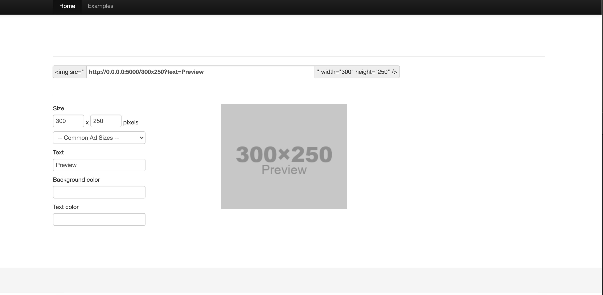
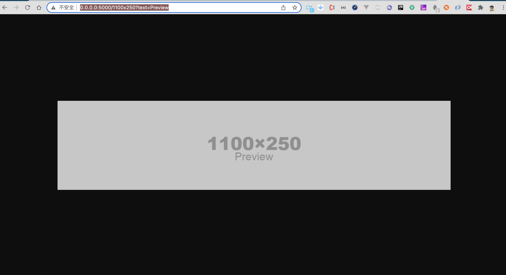

# images-size

基于web快速生成不同尺寸图片工具






## 环境要求 environment require

[如何一键安装docker环境](https://www.runoob.com/docker/centos-docker-install.html)

## 安装 Developer Setup

```bash
docker pull liyinchi/images-size:latest
```

```bash
docker run -d --name images-size -p 5000:5000 liyinchi/images-size
```

## 浏览器访问

>http://0.0.0.0:5000

>http://0.0.0.0:5000/1100x250?text=Preview
